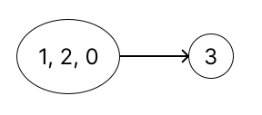

# 1192. Critical Connections in a Network

> [Leetcode link](https://leetcode.com/problems/critical-connections-in-a-network/)


## 解题思路

本题是个 hard。

题目要求我们找出关键链接，所谓关键链接就是如果去掉的话，会导致本来连通的节点不连通了

观察题目给出的图示，我们不难看出，**关键链接就是不在环上的链接**（因为只要有多个节点成环了，那么环内的每个节点至少会有两条边）

有了上述结论，我们可以把问题抽象为：**找出图中所有的环，并忽略环上的边，剩下的边就是关键链接**

比如题目中的 Example 1 可以看成：



<br />

这样一来，问题就变成了两个：

Q：如何标记一个环？

​	A：我们给每一个每一个节点一个独一无二 id，如果成环了，则环内节点 id 全部设置为当前环内节点 id 的最小值

Q：如何在图中找出环？

​	A：使用 dfs，只要遍历过程中遇到了遍历过的节点，就表示遇到环了，dfs 返回当前节点的 id

<br />

接下来，我们来理一下算法的思路：

1. 首先我们需要建立一个表 map，保存所有节点的邻接节点
2. 然后我们需要一个数组 groupId，保存每个节点的 id，初始化为 -1
3. 任选一个节点为根节点，对其进行 dfs，将根节点的 id 置为 0
4. 在 dfs 中，然后遍历当前节点的邻接节点，此时会有三种可能性：
   - 邻接节点为当前节点的父节点：直接 continue
   - 邻接节点还没遍历过 `id == -1`：对邻接节点进行 dfs，设置其 id 为当前 id+1，如果 dfs 返回的 id 比当前 id 小，更新当前 id
   - 邻接节点遍历过了 `id != -1`：表示遇到环了，更新 id 为环内最小的 id

5. 遍历并更新完邻接节点之后，我们判断一下一开始传入的 id 与更新后的 id 是否相同
6. 如果相同则表示当前节点的子节点无法遍历到父节点（因为如果可以的话 id 应该比传入 id 更小），**当前节点与父节点的链接就是关键链接**
7. 判断完之后返回当前节点的最终 id
8. 结束 dfs 之后，返回关键链接的集合就好


### C++

```cpp
class Solution {
public:
  vector<vector<int>> criticalConnections(int n,
                                          vector<vector<int>> &connections) {
    // 构造一个节点与其邻接节点的映射表
    unordered_map<int, vector<int>> map;
    buildMap(map, connections);
    // id 用来表示节点是否属于同一个组（是否成环）
    vector<int> groupId(n, -1);
    // 存放 critical connections
    vector<vector<int>> res;

    dfs(0, -1, 0, groupId, map, res);

    return res;
  }

  void buildMap(unordered_map<int, vector<int>> &map,
                vector<vector<int>> &connections) {
    for (auto connection : connections) {
      map[connection[0]].push_back(connection[1]);
      map[connection[1]].push_back(connection[0]);
    }
  }

  int dfs(int cur, int parent, int id, vector<int> &groupId,
          unordered_map<int, vector<int>> &map, vector<vector<int>> &res) {
    groupId[cur] = id;
    // 遍历当前的邻接节点
    for (int node : map[cur]) {
      if (node == parent) {
        // 邻接节点是父节点直接略过
        continue;
      } else if (groupId[node] == -1) {
        // 如果子节点没有遍历过，对其 dfs 计算子节点的 id
        // 如果子节点的 id 小于当前 id，表示成环了，要更新当前 id
        groupId[cur] = min(groupId[cur], dfs(node, cur, id + 1, groupId, map, res));
      } else {
        // 如果邻接节点有遍历过且 id 比较小，表示成环，需要更新当前 id
        groupId[cur] = min(groupId[cur], groupId[node]);
      }
    }

    // 如果传入的 id 跟计算之后的 id 相等，表示当前节点跟父节点不在同一个环内，两者之间的链接就是 critical connection
    if (id == groupId[cur] && cur != 0) {
      res.push_back({parent, cur});
    }

    return groupId[cur];
  }
};
```


### Javascript

```js
/**
 * @param {number} n
 * @param {number[][]} connections
 * @return {number[][]}
 */
var criticalConnections = function(n, connections) {
    // 构造一个节点与其邻接节点的映射表
    let map = {};
    buildMap(map, connections);
    
    // id 用来表示节点是否属于同一个组（是否成环）
    let groupId = new Array(n).fill(-1);
    // 存放 critical connections
    let res = [];
    
    dfs(0, -1, 0, groupId, map, res);
    return res;
};

var buildMap = function(map, connections) {
    for(let connection of connections) {
        map[connection[0]] ? map[connection[0]].push(connection[1]) : map[connection[0]] = [connection[1]];
        map[connection[1]] ? map[connection[1]].push(connection[0]) : map[connection[1]] = [connection[0]];
    }
}

/**
 * @param cur 当前遍历节点
 * @param parent 当前遍历节点的父节点
 * @param id 当前节点的默认 id
 * @param groupId 存放所有节点 id 的数组
 * @param map 存放所有节点与其邻接节点的映射表
 * @param res 用来放 critical connections
 * @return id 当前节点计算后的 id
 */
var dfs = function(cur, parent, id, groupId, map, res) {
    groupId[cur] = id;
    
  // 遍历当前的邻接节点
    for(let node of map[cur]) {
        if(node == parent) {
          // 邻接节点是父节点直接略过
            continue;
        } else if(groupId[node] === -1) {
          // 如果子节点没有遍历过，对其 dfs 计算子节点的 id
          // 如果子节点的 id 小于当前 id，表示成环了，要更新当前 id
            groupId[cur] = Math.min(groupId[cur], dfs(node, cur, id+1, groupId, map, res));
        } else {
          // 如果邻接节点有遍历过且 id 比较小，表示成环，需要更新当前 id
            groupId[cur] = Math.min(groupId[cur], groupId[node]);
        }
    }
  // 如果传入的 id 跟计算之后的 id 相等，表示当前节点跟父节点不在同一个环内，两者之间的链接就是 critical connection
    if(groupId[cur] === id && cur!= 0) {
        res.push([parent, cur]);
    }
    return groupId[cur];
}
```


## Reference

https://www.bilibili.com/video/BV15t4y197eq?spm_id_from=333.337.search-card.all.click
