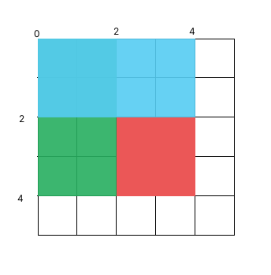

# 304. Range Sum Query 2D - Immutable

> [Leetcode link](https://leetcode.com/problems/range-sum-query-2d-immutable/)


## 解题思路

本题要求我们实现一个类，这个类包含一个构造函数以及方法

构造函数接收一个二维数组，共有 `m * n` 个元素，而方法接收二维数组的两个坐标并返回两个坐标构成的矩形内部的元素之和

<br />

题目除了核心的方法之外还让我们实现了构造函数，不难看出如果我们善加利用的话，可以显著减少每一次的计算元素和的复杂度

我们考虑构建一个新的二维数组 sum，数组的元素有 `(m+1) * (n+1)` 个，`sum[i][j]` 代表从 `(0, 0)` 到 `(i, j)` 的元素之和

有了数组 sum 之后，我们不难发现要求下图红色部分面积可以看成：全部着色区块 - 绿色区块 - 蓝色区块 + 蓝色绿色重叠区块

也就是：`sum[4][4] - sum[4][2] - sum[2][4] + sum[2][2]`



### C++

```cpp
class NumMatrix {
public:
    vector<vector<int>> sum;
    NumMatrix(vector<vector<int>>& matrix) {
        int m = matrix.size();
        int n = matrix[0].size();
        sum = vector<vector<int>>(m+1, vector<int>(n+1, 0));
        for(int i=1;i<=m;i++) {
            for(int j=1;j<=n;j++) {
                sum[i][j] = sum[i-1][j] + sum[i][j-1] - sum[i-1][j-1] + matrix[i - 1][j - 1];
            }
        }
    }
    
    int sumRegion(int row1, int col1, int row2, int col2) {
        row1++;
        col1++;
        row2++;
        col2++;
        return sum[row2][col2] - sum[row1 - 1][col2] - sum[row2][col1 - 1] + sum[row1 - 1][col1 - 1];
    }
};
```


### Javascript

```js
/**
 * @param {number[][]} matrix
 */
var NumMatrix = function(matrix) {
    let m = matrix.length;
    let n = matrix[0].length;
    this.sum = new Array(m+1);
    for(let i=0;i<m+1;i++) {
        this.sum[i] = new Array(n+1).fill(0);
    }
    for(let i=1;i<m+1;i++) {
        for(let j=1;j<n+1;j++) {
            this.sum[i][j] = this.sum[i-1][j] + this.sum[i][j-1] - this.sum[i-1][j-1] + matrix[i-1][j-1];
        }
    }
};

/** 
 * @param {number} row1 
 * @param {number} col1 
 * @param {number} row2 
 * @param {number} col2
 * @return {number}
 */
NumMatrix.prototype.sumRegion = function(row1, col1, row2, col2) {
    row1++;
    col1++;
    row2++;
    col2++;
    return this.sum[row2][col2] - this.sum[row1 - 1][col2] - this.sum[row2][col1 - 1] + this.sum[row1 - 1][col1 - 1];
};

/** 
 * Your NumMatrix object will be instantiated and called as such:
 * var obj = new NumMatrix(matrix)
 * var param_1 = obj.sumRegion(row1,col1,row2,col2)
 */
```

