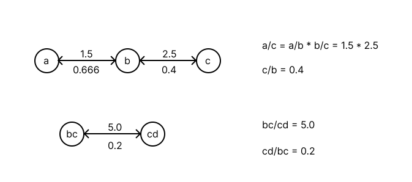

# 399. Evaluate Division

> [Leetcode link](https://leetcode.com/problems/evaluate-division/)


## 解题思路

题目给了我们一些变量的除法结果，要求我们计算出其他变量的除法结果，如果条件不足就返回 -1.0

我们可以把问题简化一下：把它变成一幅图

```cpp
equations = [["a","b"],["b","c"],["bc","cd"]]
values = [1.5,2.5,5.0]
queries = [["a","c"],["c","b"],["bc","cd"],["cd","bc"]]
```



把每个变量当成一个节点，节点之间的有向边表示相除的结果，注意节点间的有向边都是双向的，因为回来的边的权重可以用 1 除以出去的边得到。

另外图之间的节点有可能不相连，也有可能成环。

有了图之后，我们就可以用 DFS 或者 BFS 来找出两个边是否相连并且计算结果了（结果可以看成边的权重相乘）

### C++

```cpp
class Solution {
 public:
  double dfs(unordered_map<string, vector<pair<string, double>>> graph,
             unordered_set<string> visited, string start, string end) {
    if (graph.find(start) == graph.end() || graph.find(end) == graph.end()) {
      return -1;
    } else if (start == end) {
      return 1;
    }
    // 记录已访问的节点，避免图形成环无法跳出
    visited.insert(start);

    for (auto next : graph[start]) {
      if (visited.count(next.first) == 0) {
        double res = dfs(graph, visited, next.first, end);

        if (res != -1) {
          return res * next.second;
        }
      }
    }
    return -1.0;
  }

  vector<double> calcEquation(vector<vector<string>>& equations,
                              vector<double>& values,
                              vector<vector<string>>& queries) {
    int n = equations.size();
    unordered_map<string, vector<pair<string, double>>> graph(n);
    for (int i = 0; i < n; i++) {
      graph[equations[i][0]].push_back({equations[i][1], values[i]});
      graph[equations[i][1]].push_back({equations[i][0], 1 / values[i]});
    }

    vector<double> result;

    for (auto q : queries) {
      unordered_set<string> visited;
      double res = dfs(graph, visited, q[0], q[1]);
      result.push_back(res);
    }

    return result;
  }
};
```


### Javascript

```js
/**
 * @param {string[][]} equations
 * @param {number[]} values
 * @param {string[][]} queries
 * @return {number[]}
 */
var calcEquation = function(equations, values, queries) {
    let n = equations.length;
    let graph = {};
    for (let i = 0; i < n; i++) {
        !graph[equations[i][0]] && (graph[equations[i][0]] = []);
      graph[equations[i][0]].push([equations[i][1], values[i]]);
      !graph[equations[i][1]] && (graph[equations[i][1]] = []);
        graph[equations[i][1]].push([equations[i][0], 1 / values[i]]);
    }

    let result = [];

    for (let q of queries) {
      let visited = new Set();
      let res = dfs(graph, visited, q[0], q[1]);
      result.push(res);
    }

    return result;
  }

function dfs(graph,visited,start,end) {
    if (graph[start] == undefined || graph[end] == undefined) {
      return -1;
    } else if (start == end) {
      return 1;
    }
    visited.add(start);

    for (let next of graph[start]) {
      if (!visited.has(next[0])) {
        let res = dfs(graph, visited, next[0], end);

        if (res != -1) {
          return res * next[1];
        }
      }
    }
    return -1.0;
  }
```

